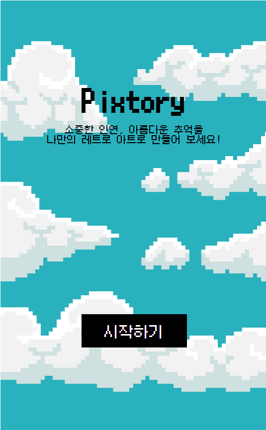
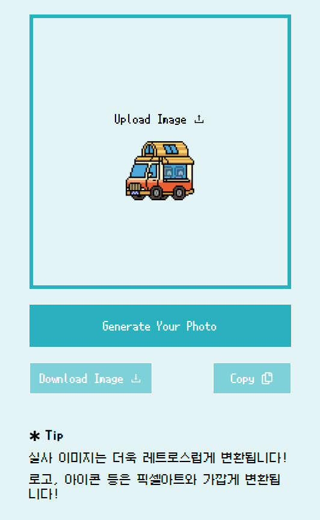

# 프로젝트명: Pixtory

### 픽셀(레트로)이미지 변환 앱 👀

### 배포주소

픽토리 바로가기: <https://elena7993.github.io/pixtory/>

### 1. 앱 이미지

### 2. 목적

- 사용자가 원하는 이미지를 레트로아트로 만들 수 있다.
- 나만의 독특한 아이콘, 로고 등을 만들 수 있다.

### 3. 기능

- 이미지 업로드와 다운로드
- 이미지 변환
- 변환된 이미지링크를 복사(안드로이트 모바일 제외)

### 4. 스택

- HTML/CSS, React, Canvas, Node.js

### 5. 개발 스케쥴

| 날짜         | 작업 내용                                                                                              |
| ------------ | ------------------------------------------------------------------------------------------------------ |
| **화 12.17** | 프로젝트명 몇 기획안 작성   레퍼런스 조사 및 피그마로 디자인 작업   코드 초기세팅 및 깃허브 연동 |
| **수 12.18** | 디자인 완료   개발 시작   홈 화면 및 메인페이지 로직 구현 (이미지 업로드, 다운로드)              |
| **목 12.19** | 메인페이지 로직 구현 (이미지 쉐어, 이미지 변환)                                                        |
| **금 12.20** | 전체 코드 점검 및 수정   디버깅 후 배포                                                             |

### 6. 문제해결과정 및 느낀점 📖

#### (1)상황

navigator.clipboard를 사용해 이미지링크를 카피하기 위한 기능을 구현하고자 하였다.

#### (2)발생한 문제

웹과 ios에서는 잘 작동되었으나 안드로이드에서는 작동이 되지 않았다.

#### (3)문제 원인

주된된 문제원인은 크게 두 가지로 추정할 수 있었다.
(콘솔에도 그 어디에도 에러가 나오지 않았기에...)

1. navigator.clipboard가 안드로이드의 일부 브라우저에서는 지원되지 않을 수 있다는 것.
2. 안드로이드에서는 브라우저마다 클립보드 API 구현 방식이 다를 수 있어서 정상적으로 작동하지 않을 수 있다는 것.

#### (4)시도한 방법 및 대안

안드로이드 모바일에서만 복사 기능이 작동하지 않는 점을 고려해, 복사 버튼이 안드로이드 환경에서 렌더링되지 않도록 처리하였다. 이를 위해 deviceType을 감지하는 로직을 추가했다.

- navigator.userAgent를 사용해 디바이스가 안드로이드인지 확인
- 안드로이드 기기로 감지되면 복사 버튼을 숨김 처리하여 사용자 경험을 보완.

#### (5)개인 회고 및 향후 계획

결론적으로, 안드로이드 모바일 환경에서는 복사 버튼을 숨기는 방식으로 문제를 해결했다. UI는 개선되었다고 할 수 있지만, UX 측면에서는 부족함이 느껴진다. 어쩌면 "링크 공유"라는 방식을 고집한 탓에 UX 최적화에는 실패했을 수도 있다.

이번 경험을 통해 "내가 하고 싶은 개발"과 "사용자가 필요한 개발" 사이의 균형이 얼마나 중요한지 다시 한 번 깨달았다. 오늘도 그 균형을 맞추기 위해 고민했지만, 쉽지 않았다. 그래도 한 번씩 이런 고민과 시도를 하다 보면 언젠가는 최적의 해답에 도달할 수 있겠지! 💪🏼

매번 작업하면서 느끼는 건, 개발의 과정은 마치 운전을 하는 것 같다. 한적한 바닷길을 달리며 상쾌함을 느낄 때도 있지만, 꽉 막힌 도심 속에서 지난한 시간을 보내야 할 때도 있다. 그럼에도 불구하고 계속 달려야 한다. 왜냐하면...어렵지만 그만큼 재밌으니까! 😋
